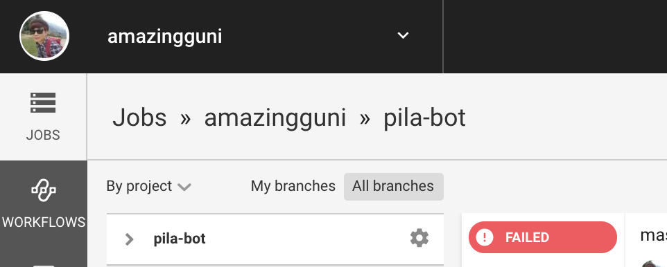

# Pila Bot

필라테스 예약을 하기 위해 만들어진 Repository입니다. CircleCI를 통해 주기적으로 구동되며 여러대의 워커에서 Selenium으로 브라우저를 열어 예약 작업을 진행합니다.

## How to use

먼저 GitHub Repository를 자신의 계정으로 Fork합니다. 


Fork한 Repository에 들어가서 `.circleci/config.yml`의 내용을 다음과 같이 바꿔줍니다.

> 기존에는 2명 이상을 지원하기 위해 `context`라는 기능을 사용하고 있지만 fork해서 구성하는 경우에는 불필요합니다. 그 부분을 제거합니다.

```yml
version: 2.1
jobs:
  pila:
    docker:
      - image: circleci/python:3.6-browsers
    parallelism: 2
    parameters:
      extra-opts:
        type: string
        default: ""
    steps:
      - checkout
      - restore_cache:
          keys:
            - v1-dependencies-{{ checksum "requirements.txt" }}
            - v1-dependencies-

      - run:
          name: install dependencies
          command: |
            python3 -m venv venv
            . venv/bin/activate
            pip install -r requirements.txt
      - save_cache:
          paths:
            - ./venv
          key: v1-dependencies-{{ checksum "requirements.txt" }}

      - run:
          name: Reserve pilates
          command: |
            . venv/bin/activate
            python pila.py -u "${USER}" -p "${PASSWORD}" -w "${WEEKDAYS}" -t "${TIME}" << parameters.extra-opts >>
workflows:
  commit:
    jobs:
      - pila
  openning:
    triggers:
      - schedule:
          cron: "50 2 * * *"
          filters:
            branches:
              only:
                - master
    jobs:
      - pila:
          extra-opts : "--wait-opening"
```

Fork한 Repository를 연동하기 위해 CircleCI에 접속합니다.

- https://circleci.com/dashboard

좌측 상단에 자신의 아이디가 선택되었는지 확인한 이후에 좌측의 `ADD PROJECT`를 클릭합니다.


`pila-bot`을 찾고 우측의 `Set Up Project` 버튼을 클릭합니다.


`Start Building` 버튼을 클릭합니다.


여기까지 진행하면 CircleCI가 첫번째 작업을 실행합니다. 하지만 계정정보를 입력하지 않았기 때문에 에러가 발생할 것입니다. 다시 CircleCI로 접속해 계정과 예약 정보를 입력해줍니다.

먼저 [CircleCI로 다시 접속](https://circleci.com/dashboard)하고 `pila-bot`의 설정 페이지로 접속(톱니 아이콘)합니다.



좌측의 `BUILD SETTINGS - Environment Variables` 메뉴를 선택합니다.

Environment Variables 페이지에서 `Add Variables` 버튼을 눌러 하나씩 환경 변수를 추가해줍니다.

|Name|Desc|Example|
|---|---|---|
|USER|계정 이름|1234|
|PASSWORD|접속 비밀번호|1234|
|TIME|예약을 원하는 날짜와 시간(여러개일 경우 ,로 구분)|월20:00,목19:30|

그리고 좌측의 `JOBS` 메뉴를 누르고 실패했던 빌드를 클릭해 `Rerun workflow`를 클릭하면 완료됩니다

> 혹시 모르니.. 자동 예약이 수행될때 잘 되는지 모니터링해주세요 :)


